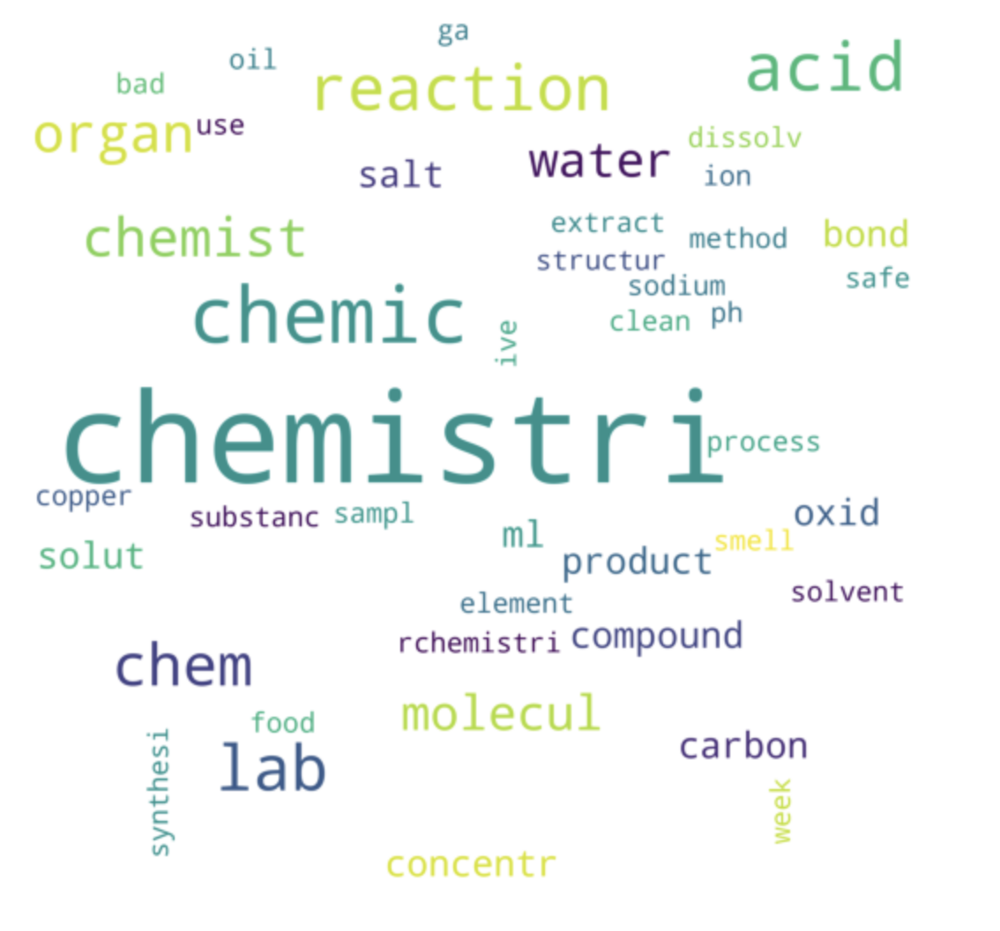

# SUBREDDIT CLASSIFICATION
#### Sophia Scarano
#### DSIR-824
<table><tr>
<td> </td>
<td>  </td>
</tr></table>

# Problem Statement
The goal of this project is to classify a given post in Reddit as being either from the subreddit **r/Physics** or the subreddit **r/chemistry**. Both of these topics are heavily related in the science field, but I hypothesize that their distinguishable jargon could potentially aid in this classification.

# Get the data
In order to create an appropriate dataset, I gathered 100 posts per week per subreddit from the past two years, and then filtered based on whether they had 'usable information'. In order for a post to qualify as having 'usable information', I determined that both the subject line and the title could not be blank and had to have at least four words (to avoid spam/bot posts). This requirement cut the dataset by a fair amount, but in the end I had a dataset with 3,846 rows, and 4 columns. These columns correspond to the posts' title text information, their selftext (actual post) text information, the date and time at which the post was created (UTC type), and the subreddit that each post belongs to.

# Preprocessing
I then moved on to preprocessing the data, where I started by removing special characters and accented characters. I then tokenized both the selftext and title columns, which splits the sentences into lists of the individual words. I then created four columns:
- one for the selftext column after it had been lemmatized
- one for the title column after it had been lemmatized
- one for the selftext column after it had been stemmed
- and one for the title column after it had been stemmed. 

The purpose of doing this was to reduce each word to either its 'lemma', which is a method of grouping words by their intended meaning based on their dictionary lemma, or its 'stem', which is essentially a crude, more concise way of using lemmatization. I removed common English stopwords from both of these text dataframes to reduce noise in the analysis, and was ready to go.

Note: For the modeling itself, I decided to use the columns with stemmed text because it is more concise in its ability to achieve the roots of the relevant words

# Modeling
I compared two types of models for this classification problem, one being the Naive Bayes model, and the other being a Logistic Regression model. However, before I began evaluating these algorithms, I first determined the baseline score given this data. I determined this value based on if the user were to randomly guess that a given post belongs to the chemistry subreddit (class '0'), and found this accuracy to be around 51%.

### Naive Bayes
I used the multinomial Naive Bayes algorithm, where 'multinomial' is just related to the nature of the distributions we're proposing. I then made a pipeline that included a count vectorizer before the naive bayes algorithm, and grid searched over several parameters (not for the estimator, but for the count vectorizer inside the estimator). Parameters that I searched over:
- max_df: this value is a float between 0 and 1 which corresponds to the maximum document frequency proportion of words in the document that we will accept.
- min_df: this is an integer corresponding to the minimum number of times a word shows up in a document for us to count it.
- max_features: only consider this number of most frequently occurring words.
- ngram_range: only caputre n-word phrases as features. This could be useful for phrases like "black hole" (ngram = 2), where the individual words may not have as much as an impact on the prediction of a phrase being in r/Physics or r/chemistry, but when put together make it clear that this is a post pertaining to astrophysics, and therefore would most likely be in r/Physics.

#### NB Conclusions:
using values of:
- max_df: 0.5
- min_df: 1
- max_features: 200
- ngram_range: (1,2)

This model was able to achieve an accuracy score of 84.5%, which is an improvement over the baseline accuracy.

### Logistic Regression
When using Logistic Regression as the model for this binary classification problem, it is important to note that when searching over potential parameters, it is not only necessary to search over the count vectorizer parameters, but also two parameters in particular for the estimator itself. These two logistic regression parameters, in addition to the count vectorizer parameters listed in the Naive Bayes section above, are:
- penalty: 'l1', 'l2' : zthese penalties are used to specify the norm used in the penalization, with l1 corresponding to Lasso Regularization, and l2 corresponding to Ridge Regularization.
- C: This is a positive float, with the value being inversely proportional to the strength of the regularization (lower value = stronger regularization)

#### LR Conclusions:
using values of:
- max_df: 0.5
- min_df: 1
- max_features: 200
- ngram_range: (1,2)
- penalty: l2
- C: 1

This model was able to achieve an accuracy score of 90.5%, which is an improvement over both the baseline accuracy and the Niave Bayes model.

# Comparing TFIDF vs CountVectorizer:
Both of these methods are essentially the idea of taking a 'bag of words', splitting this bag into the individual words, and converting each of them into a vector of word frequencies. Count Vectorizer is the more simplified version of this, where you end up creating a pure frequency vector by first creating a dictionary of the most common words in the sentences, and then encoding the sentences using that dictionary. TFIDF is also a simple technique to find features from sentences. However, while in CountVectorizer we take the count of all the words (or ngrams) presented in a document, with TFIDF we take features only for the most significant words. In order to understand what this means, let's take a look at what TFIDF actually stands for:
- TF: Term Frequency
    - How important is the word in the document?
    - number of occurrences of the word in the document / total number of words in the document
- IDF: Inverse Document Frequency
    - How important is the term in the whole corpus?
    - log of the ratio of documents that include the word
- All together: TFIDF is the multiplication of these two scores

Remember: the words with the most influential coefficients one way or the other don't just represent the words that are most likely to appear in comments by a given subreddit category. They also have to be **unlikely** to appear in comments made by the other subreddit. 

#### TFIDF conclusions:
When performing a logistic regression model using the TFIDF vectorizer, the accuracy score was on par with the accuracy score when using the CountVectorizer, with a value of 90.5% on the testing data. Also, using this TFIDF vectorizer seemed to overfit on the training data, which makes sense based on the inherent nature of discussing the calculation of the 'importance' of each feature in a document

# Overall Conclusions:
### Naive Bayes or Logistic Regression?
In short, I recommend using **Logistic Regression** when classifying a reddit post as being in r/Physics or r/chemistry. This is for several reasons:
- First, the naïveté of the Naive Bayes algorithm is that it assumes that all the features, or in this case, the words, are linearly independent. 
- I believe that it is this assumption that made the Naive Bayes model less effective, because when people post questions on reddit the words are inherently connected. 

Additionally, Here I recommend using the **Count Vectorizer** to determine feature importance:
- It does not overfit to the training data
- It allows for discussion surrounding the most relevant features in each subreddit.

If there were more data available for this task, I would recommend using the TFIDF vectorizer because its conception makes more sense:
- the words with the most influential coefficients one way or the other don't just represent the words that are most likely to appear in comments by a given subreddit category. They also have to be unlikely to appear in comments made by the other subreddit. 
- If there were more data, it has less of a likelihood of overfitting.

# Visualization: Most Important Words
#### For r/Physics, the most relevant root words are:

#### For r/chemistry, the most relevant root words are:
